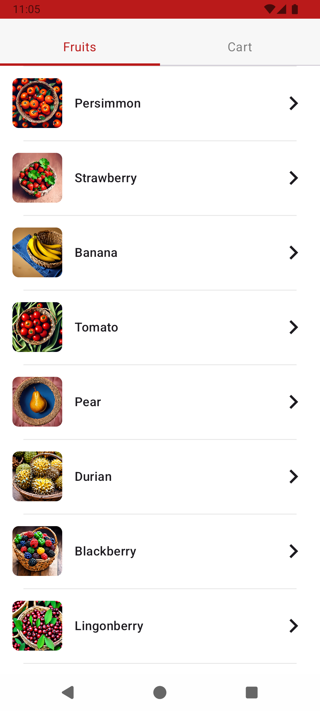

# Challenge - iFood

# Sumário

- [Motivação de Negócio (Problema e Solução)](#motivação-de-negócio)
- [Tecnologias Utilizadas](#tecnologias-utilizadas)
- [Arquitetura](#arquitetura)
- [Mapeamento de Endpoints](#mapeamento-de-endpoints)
- [Cenários de Teste](#cenários-de-teste)

# Motivação de Negócio

## Hipótese
O time de negócio do iFood gostaria de testar a hipótese de que itens contendo fotos são mais comprados do que itens sem foto. Para testar essa hipótese foi escolhidos a tab de Feira dos Mercados.

Métrica: itens adicionados ao carrinho

## Solução

Para isso, foi desenvolvida uma listagem de itens com as imagens geradas por IA com base no nome de cada fruta e posteriormente serão trackeados os cliques em "Add to Cart". O release será controlado por feature flag e o time negócios irá comparar as métricas entre as duas versões.

A tab "Fruits" (Listagem de Frutas) recebe lista de frutas de endpoint externo e grava na memória.
A tab "Cart" (Listagem do Carrinho) exibe os itens salvos de forma local.

 

  
&nbsp; &nbsp; &nbsp; &nbsp;
  

---

## Tecnologias Utilizadas

- **Kotlin** — Linguagem de programação
- **Jetpack Compose** — UI
- **Koin** — Injeção de dependência
- **Room** — Persistência local
- **Retrofit** — Consumo de APIs REST
- **JUnit, Mockito** — Testes unitários (usecase, viewmodel), testes integrados (Repository), testes instrumentados (screen) e mocks

---

# Arquitetura

O projeto adota a arquitetura **Clean Architecture** com separação em camadas:

- **Presentation:** ViewModels e UI (Jetpack Compose/Activities/Fragments)
- **Domain:** Casos de uso e modelos de negócio
- **Data:** Repositórios, datasources locais (Room) e remotos (Retrofit)
- **DI:** Injeção de dependências com Koin

---

# Mapeamento de Endpoints

## Listagem de Frutas

Utilizado o [FruityVice](https://www.fruityvice.com/doc/index.html) que é um endpoint público gratuito que retorna uma lista com frutas e seus detalhes científicos/nutricionais.

| Método | Endpoint             | Descrição                                   | Parâmetros de Entrada                   | Resposta de Sucesso | Erros Comuns                      |
|--------|----------------------|---------------------------------------------|-----------------------------------------|---------------------|-----------------------------------|
| POST   | https://www.fruityvice.com/api/fruit/all     | Listagem de todas as frutas  | -         | Listagem de frutas (JSON)      | 500 Internal Server Error                  |

  
Exemplo de Response - 200 Success

[
{
"name": "Apple",
"id": 6,
"family": "Rosaceae",
"order": "Rosales",
"genus": "Malus",
"nutritions": {
"carbohydrates": 11.4,
"protein": 0.3,
"fat": 0.4,
"calories": 52,
"sugar": 10.3
}
},
{
"name": "Banana",
"id": 1,
"family": "Musaceae",
"order": "Zingiberales",
"genus": "Musa",
"nutritions": {
"carbohydrates": 22,
"protein": 1,
"fat": 0.2,
"calories": 96,
"sugar": 17.2
}
}
]

## Geração de Imagem de IA - Cloudfare Workers AI

Utilizado o [Cloudfare Workers IA](https://developers.cloudflare.com/api/resources/ai/methods/run/) que fornece um endpoint que retorna uma imagem gerada por IA com base em texto.  
O prompt utilizado é: **"A {NOME_DA_FRUTA} in a basket, vibrant colors"**  
O modelo utilizado é: **@cf/bytedance/stable-diffusion-xl-lightning**

| Método | Endpoint            | Descrição                                   | Parâmetros de Entrada (Body)                           | Resposta de Sucesso | Erros Comuns                      |
|--------|---------------------|---------------------------------------------|-------------------------------------------------|---------------------|-----------------------------------|
| POST    | https://api.cloudflare.com/client/v4/accounts/{ACCOUNT_ID}/ai/run/{AI_MODEL_NAME}      | Gera uma imagem com base em texto         | prompt (texto base para geração da imagem), model (modelo de IA escolhido)                                               | Raw Base64 da imagem no body da resposta   | 500 Internal Server Error

  
Exemplo de Response - 200 Success

BASE64 raw da imagem .PNG

---

## CENÁRIOS DE TESTE

## Tela 1: Listagem de Frutas

### Identificação

- **ID:** Tela-001
- **Módulo:** fruits
- **Responsáveis:** Time de desenvolvimento e equipe de QA

### Descrição

Validar se a listagem de frutas (textos e imagens) é exibida corretamente ao usuário.  
Validar se a listagem de frutas (textos) é exibida corretamente ao usuário quando as imagens não foram geradas.  
Validar se a listagem de frutas exibe mensagem de erro quando textos dos itens estão indisponíveis.

### Pré-condições

- Aplicativo com acesso a internet.

### Passos do Teste

| Cenário | Ação                                 | Dados de Entrada     | Resultado Esperado                               |
|-------|--------------------------------------|---------------------|--------------------------------------------------|
| 1     | Acessar tela de listagem com carregamento de textos e imagens               |                    | Listagem com itens e imagens exibida conforme especificações do Figma                          | 
| 2     | Acessar tela de listagem com carregamento de textos e sem imagens geradas   |     | Listagem com itens e deve ser exibida conforme especificações do Figma. Tracking de clique para teste A/B não deve ser disparado.  |
| 3     | Informar usuário ou senha inválidos  |  | Mensagem de erro exibida corretamente conforme Figma                        |

### Pós-condições

- Imagens carregadas devem ser mantidas ao navegar para tela de Detalhes/Aba de Carrinho e voltar.

### Critérios de Aceitação

- Experiência de sucesso e falha conforme o Figma
- Tracking do teste A/B validado com sucesso

### Outros Cenários de Teste

- **Tela de detalhes da fruta:**  
  Confirma se os detalhes de uma fruta são apresentados corretamente ao selecionar um item.

- **Adicionar fruta ao carrinho:**  
  Garante que a fruta selecionada é adicionada ao carrinho corretamente e persistida localmente.

- **Remover fruta do carrinho:**  
  Garante que a fruta selecionada é deletada do carrinho corretamente e atualização da UI.

- **Geração de imagem IA:**  
  Valida que a imagem gerada é exibida corretamente ao usuário. Valida que um placeholder é exibido caso a imagem não seja gerada corretamente.

---

